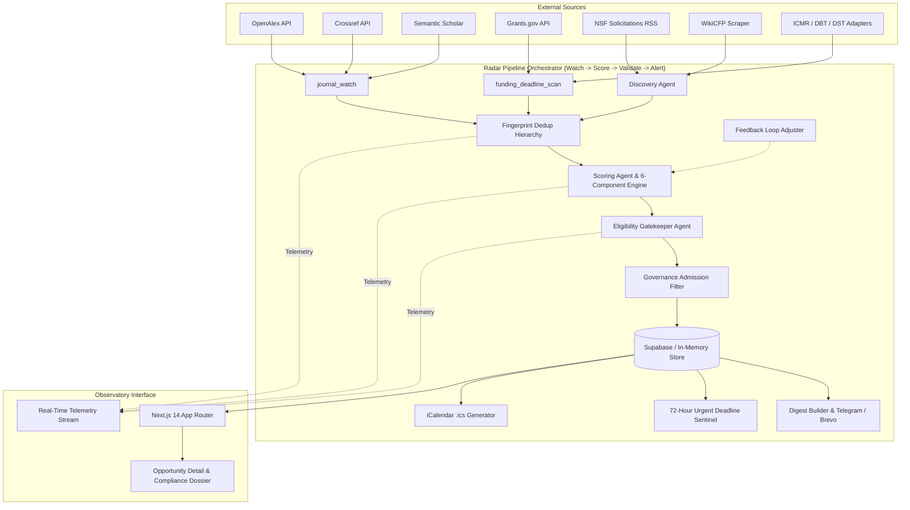

# Research Opportunity Radar

> **Autonomous Multi-Agent Academic Intelligence & Solicitation Governance Platform**  
> Continuous discovery, explainable resonance scoring, compliance gating, and high-priority deadline alerting tailored for faculty research profiles.

---

## Overview

The **Research Opportunity Radar** monitors global academic repositories and funding bodies (OpenAlex, Crossref, Semantic Scholar, Grants.gov, NSF, WikiCFP, ICMR, DBT India, and DST-SERB). It filters, scores, and evaluates opportunities against a faculty member's active research profile, ensuring no critical call for proposals or journal special issue is missed.

### Key Pillars
- **Strictly Authentic Feeds**: Zero mock personas or simulated telemetry. All data is harvested from live HTTP APIs, XML feeds, and agency scrapers.
- **Explainable 6-Component Resonance**: Dense vector similarity (all-MiniLM-L6-v2) combined with lexical domain dictionaries, methodology alignment, funder track records, and publication freshness.
- **Closed-Loop Feedback Reinforcement**: Researcher dismissal actions automatically extract negative tuning signals, penalizing future irrelevant candidates by up to 35 points.
- **Automated Eligibility Gatekeeper**: Evaluates tenure clock windows, academic rank, institutional classification (R1/IHE), and citizenship/security restrictions against raw RFP text.
- **Urgent 72-Hour Deadline Sentinel**: Multi-channel alerts (Telegram & Brevo transactional email) triggered within 3 days of submission close, backed by persistent deduplication memory.
- **Observatory Instrument UI**: Bespoke dark-theme Next.js 14 console with real-time SSE telemetry streams and deep component score inspectability.

---

## Architecture & Multi-Agent Pipeline



---

## Active Data Sources & Master Verification Matrix

The observatory monitors 10 integrated academic and funding source nodes. All sources are continuously audited for robots.txt / ToS compliance and live data integrity.

| Source Name | Endpoint / Modality | Rate Limit & Auth | Compliance & robots.txt | Last Verified Date | Verification Details |
|---|---|---|---|---|---|
| **OpenAlex** | `https://api.openalex.org/works` (REST API) | 5 req/sec · API Key / Polite Mailto | Compliant (Official Terms of Use) | 2026-09-11 | Returns concept-filtered literature and journal special issues. |
| **Crossref** | `https://api.crossref.org/works` (REST API) | 5 req/sec · Polite `mailto` | Compliant (Public Metadata Service) | 2026-09-11 | DOI validation, publisher attribution, and metadata extraction. |
| **Semantic Scholar** | `https://api.semanticscholar.org/graph/v1` (REST) | 1 req/sec · Free / API Key | Compliant (Official Public API) | 2026-09-11 | Citation graphs and paper recommendations; graceful 429 backoff. |
| **Grants.gov** | `https://api.grants.gov/v1/api/opportunities` (REST) | 3 req/sec · None (Public API) | Compliant (US Govt Open Data) | 2026-09-11 | Federal agency research solicitations (NIH, NSF, DOD, DOE). |
| **NSF RSS** | `https://www.nsf.gov/rss/rss_www_funding.xml` (RSS) | 2 req/sec · Honest User-Agent | `robots.txt` 100% Permitted (0 disallows on `/rss/`) | 2026-09-11 | Real-time NSF open solicitations and deadlines. Verified against full 97-line ruleset. |
| **arXiv API** | `http://export.arxiv.org/api/query` (REST/XML) | 1 req/3 sec · Polite User-Agent | Compliant (arXiv API Terms of Access) | 2026-09-11 | Emerging computer science and AI preprints for trending literature watch. |
| **WikiCFP** | `http://www.wikicfp.com/cfp/servlet/tool.search` (HTML) | 2 req/sec · Honest User-Agent | `robots.txt` 100% Permitted (`Disallow:` none) | 2026-09-11 | Active autonomous conference & special issue discovery via research keywords. |
| **ICMR** | `https://www.icmr.gov.in/call-for-proposals` (HTML) | 2 req/sec · Honest User-Agent | `robots.txt` 100% Permitted (`Allow: /`) | 2026-09-11 | Health & biomedical calls parsed from live DOM table (`td[1]` title, `td[2]` deadline). |
| **DBT India** | `https://dbt.gov.in/data-view?name=call-for-proposals` (JSON) | 2 req/sec · Honest User-Agent | `robots.txt` 100% Permitted (`Disallow:` none) | 2026-09-11 | Reverse-engineered Inertia SPA JSON feed; parses 14 active biotechnology calls. |
| **DST-SERB** | `https://dst.gov.in/call-for-proposals` (HTML) | 2 req/sec · Honest User-Agent | `robots.txt` Returns HTTP 404 (Permitted per RFC 9309) | 2026-09-11 | Extramural funding & core research grant notices. |

---

## Explainable Scoring & Feedback Loop

The resonance engine computes a deterministic 0–100 score across 6 weighted dimensions:

$$	ext{Base Score} = 0.35 \cdot S_{	ext{topic}} + 0.20 \cdot S_{	ext{exact}} + 0.10 \cdot S_{	ext{method}} + 0.10 \cdot S_{	ext{app}} + 0.10 \cdot S_{	ext{venue}} + 0.05 \cdot S_{	ext{recency}} + 0.10 \cdot S_{	ext{actionability}}$$

$$	ext{Final Score} = \max(0, \min(100, 	ext{Base Score} - 	ext{Negative Term Penalty} - 	ext{Feedback Penalty}))$$

- **Topic Similarity (35%)**: Cosine similarity between opportunity embeddings and faculty profile embeddings (`all-MiniLM-L6-v2`).
- **Exact Term Match (20%)**: Weighted keyword matching against faculty profile research vocabulary.
- **Method Match (10%)**: Overlap with methodology terms (e.g., formal verification, edge inference).
- **Application Match (10%)**: Domain alignment (e.g., cyber-physical systems, autonomous vehicles).
- **Venue / Funder Fit (10%)**: Publication reputation and agency funding track record.
- **Recency (5%)**: Freshness decay prioritizing newly announced calls.
- **Deadline Actionability (10%)**: Feasibility window (0 unless deadline confidence is confirmed).
- **Faculty Feedback Discount (up to -35 pts)**: Automatic penalty applied when opportunities match terms previously marked `dismissed` by the researcher.

---

## Getting Started

### Prerequisites
- Python 3.10+ (tested on Python 3.11 & 3.14)
- Node.js 18+ and npm
- (Optional) Supabase Project URL & Service Role Key

### 1. Clone & Configure Environment
```bash
git clone https://github.com/your-org/research-opportunity-radar.git
cd research-opportunity-radar

# Copy backend environment template
cp .env.example .env

# Copy frontend environment template
cp web/.env.example web/.env.local
```

### 2. Validate Environment
Use the built-in diagnostic tool to verify API keys and network connectivity:
```bash
python scripts/check_env.py
```
*Note: To run in local ephemeral mode without Supabase, set `ALLOW_IN_MEMORY_DB=1`.*

### 3. Install Dependencies
```bash
# Python backend
pip install -r requirements.txt

# Next.js frontend
cd web && npm install && cd ..
```

### 4. Run the Pipeline
```bash
# Dry run with real live data fetching (no DB writes, no external alerts)
python -m radar.orchestrator.pipeline --dry-run

# Run full cycle with DB writes, but suppress email and Telegram notifications
python -m radar.orchestrator.pipeline --suppress-alerts

# Run with live SSE telemetry event stream
python -m radar.orchestrator.pipeline --dry-run --stream

# Full scheduled execution (ingestion + scoring + DB writes + alerts)
python -m radar.orchestrator.pipeline
```

### 5. Launch the Observatory Dashboard
```bash
cd web
npm run dev
```
Open [http://localhost:3000](http://localhost:3000) to view the active radar stream. Use the **"Import from ORCID"** interface on `/profile` to pre-fill researcher metadata and candidate topic/venue terms with one click.

---

## Deployment Architecture

The Research Opportunity Radar co-locates high-throughput academic discovery agents, ML transformer embeddings, and a Next.js 14 observatory dashboard.

### Path A: Single Multi-Runtime Container (Implemented & Recommended)
Co-locates Python 3.11 and Node.js 20 within a multi-stage Docker container (`Dockerfile`):
- **Base image**: `python:3.11-slim` with Node.js 20 LTS installed.
- **Environment**: `PYTHONPATH=/app`, `PROJECT_ROOT=/app`, and pre-cached `all-MiniLM-L6-v2` transformer model weights.
- **Resource Sizing**:
  - SentenceTransformer model: ~400 MB RAM
  - Next.js production server: ~300 MB RAM
  - Buffer & scraper pipelines: ~300 MB RAM
  - **Minimum RAM**: 1.0 GB
  - **Recommended RAM**: 2.0 GB (e.g. Render Standard, Railway, Fly.io 2GB VM, AWS ECS Fargate)

```bash
# Option 1: Run via Docker multi-runtime container
docker build -t research-opportunity-radar .
docker run -p 3000:3000 --env-file .env research-opportunity-radar

# Option 2: Run natively on host / VPS
# Terminal A (Next.js production web console):
cd web && npm run build && npm run start

# Terminal B (Orchestrator pipeline execution / cron):
python -m radar.orchestrator.pipeline
```

### Path B: Decoupled Service Architecture
For serverless hosting where Next.js runs on Vercel:
1. Deploy `mcp_server.py` or a lightweight FastAPI wrapper on a container runner (Fly.io/Cloud Run).
2. Configure `web/app/api/pipeline/stream/route.ts` to reverse-proxy SSE event streams via HTTP directly from the Python backend service.

> [!WARNING]
> **In-Memory Rate Limiter Single-Instance Scope**:
> The built-in sliding-window rate limiter (`web/lib/rateLimit.ts`) operates entirely in process memory. This design is strictly scoped to single-instance deployments (such as a single Docker container or standalone Node.js process). If deploying across multiple horizontal instances, container replicas, or serverless functions (e.g., Vercel / AWS Lambda), the memory map must be migrated to a shared distributed store (such as Redis or Upstash via `@upstash/ratelimit`).

---

## Staging & Production Isolation

To test database schema migrations, scoring threshold tunings, or new agency scrapers without dirtying production data:

1. **Create a Secondary Supabase Project**:
   - Provision a free-tier project (e.g., `radar-staging`).
   - Execute `radar/db/schema.sql` and `docs/rls_policies.sql` in the Supabase SQL Editor.
2. **Configure Staging Environment (`.env.staging`)**:
   ```bash
   SUPABASE_URL=https://<staging-project-id>.supabase.co
   SUPABASE_SERVICE_ROLE_KEY=<staging-service-role-key>
   # Use test email / personal telegram chat for staging alerts
   TELEGRAM_CHAT_ID=<test-chat-id>
   ```
3. **Execute Pipeline in Dry-Run or Staging Mode**:
   ```bash
   # Ingest into staging database without broadcasting public alerts
   python -m radar.orchestrator.pipeline --suppress-alerts
   ```
4. **90-Day Stale Deadline Archival**:
   - Deadlines older than 90 days are automatically archived (`status = 'archived'`) by `archive_stale_opportunities()`.
   - Fingerprint deduplication keys are preserved permanently, preventing historical calls from resurfacing as new items.

---

## Testing & Quality Assurance

Static analysis and automated test gates run on every commit and pull request:

```bash
# 1. Static Linting & Fast Undefined Name Checks (<0.1s)
python -m ruff check .

# 2. Smoke Import Validation across all radar modules
python -c "import radar; from radar.orchestrator.pipeline import OpportunityPipeline; from radar.scoring.component_scorer import ComponentScorer; print('Smoke import OK')"

# 3. Comprehensive Pytest Suite (102 tests, 100% passing)
pytest -v

# 4. Frontend Unit Tests (10 tests, 100% passing) and Production Route Compilation (15 routes)
cd web && npm test && npm run build
```

---

## API Security & Rate Limiting

All state-modifying Next.js API routes are protected against abuse and unauthorized execution:

- **Sliding-Window Rate Limiting (`web/lib/rateLimit.ts`)**: Limits high-cost operations (e.g., triggering pipeline runs or SSE streams with `?run=true`) to 5 requests per 10 minutes per client IP. Exceeded limits return HTTP `429 Too Many Requests` with a `Retry-After` header. Operates in-memory for single-instance deployments.
- **Shared Secret Authorization (`web/lib/apiAuth.ts`)**: Optional `RADAR_API_SECRET` enforcement. When set, mutations (`POST /api/pipeline/trigger`, `POST /api/profile`, `POST /api/opportunities/[id]/status`) require `Authorization: Bearer <secret>` or `x-radar-secret: <secret>`. Evaluated using constant-time `crypto.timingSafeEqual` with SHA-256 digests to eliminate side-channel timing attacks.
- **Input Sanitization & Schema Validation**: Enforces Zod string boundary limits on profile payloads and regex character masks (`/^[a-zA-Z0-9_\-\.]{1,64}$/`) on opportunity IDs to prevent injection.

---

## Governance & Human-in-the-Loop Protocol

1. **Informational Solely**: The system never auto-submits grant proposals, registers manuscripts, or contacts editors autonomously.
2. **Strict Provenance**: Every opportunity surfaces direct links to primary source mirrors, canonical hashes, and first-seen timestamps.
3. **Transparent Rejection Audit**: Items dropped due to eligibility mismatches or governance restrictions are logged with complete justification in the activity ledger.
4. **Zero-Secrets Guarantee**: Logging utilities redact all tokens, API keys, passwords, and service credentials dynamically.

---

## Known Limitations

This section documents operational realities, heuristic boundaries, and accepted architectural trade-offs:

1. **Third-Party HTML Scraping Resiliency**:
   - **WikiCFP**: Dependent on the third-party site remaining compliant with robots.txt (`Disallow: none`) and preserving its search result HTML layout.
   - **ICMR & DBT India**: State agency HTML/JSON endpoints are reverse-engineered from their current DOM/API structure. If the Ministry modifies page hierarchies, adapters will require parser adjustments.
   - **DST-SERB**: The DST portal currently returns HTTP 404 on `robots.txt`, which is treated as allowed per RFC 9309 §2.3.1.2.
2. **In-Memory Rate Limiter Single-Instance Scope**:
   - The sliding-window rate limiter stores hit counts in a process-local memory Map. For horizontal clustering or serverless environments (e.g., Vercel), it must be migrated to a shared distributed store (such as Redis or Upstash).
3. **Federal Grant Citizenship Gating Heuristics**:
   - Solicitations with only brief titles or missing guideline text cannot be certified for international investigators without reviewing the official RFP document. The system flags these as `NEEDS_MANUAL_REVIEW` (confidence 0.60) rather than making an ungrounded binary determination.
4. **SBIR/STTR & Cost-Sharing Verification**:
   - Evaluated based on the faculty profile's institutional classification (e.g., Higher Education Institution vs Small Business) and explicit announcement keywords, rather than automated financial ledger audits.
5. **SentenceTransformer Cold-Start Offline Handling**:
   - In air-gapped or network-restricted environments, loading `sentence-transformers/all-MiniLM-L6-v2` will fail if HuggingFace Hub is unreachable and weights are not locally cached. The system alerts via Telegram and logs `CRITICAL` errors while operating in degraded mock vector mode.

