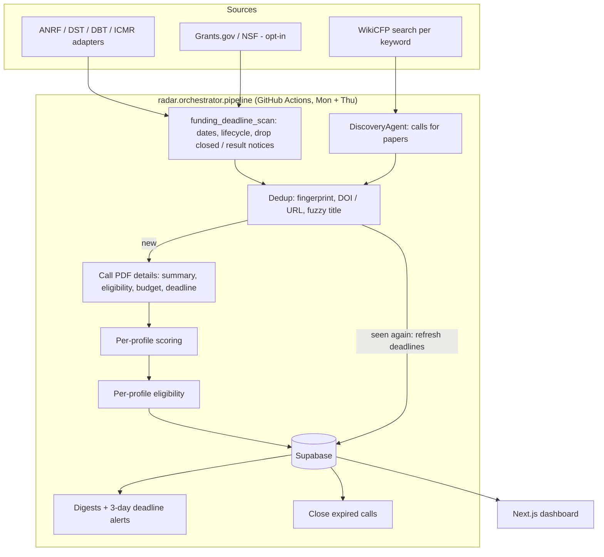

# Research Opportunity Radar

> **Autonomous Multi-Agent Academic Intelligence & Solicitation Governance Platform**  
> Continuous discovery, explainable resonance scoring, compliance gating, and high-priority deadline alerting tailored for faculty research profiles.

---

## Overview

Research Opportunity Radar finds funding calls and calls for papers for faculty in India, ranks them
against each person's research profile, checks the eligibility rules stated in each call, and sends
digests and 3-day deadline warnings by email or Telegram.

- **Sources**: ANRF, DST, DBT and ICMR/DHR calls; conference and journal calls for papers (WikiCFP);
  optionally Grants.gov and NSF. Details are read from each call's PDF.
- **Scoring**: similarity to the researcher's summary plus their own terms, deadline and recency
  (see *Scoring & Eligibility*); every component is shown on the opportunity page.
- **Eligibility**: nationality, age limit, years to superannuation, regular post, region-only calls
  and years since PhD, quoted from the call; anything uncertain is flagged for manual review.
- **Alerts**: digest after each scan (Monday and Thursday mornings IST) with each user's band and
  minimum score; deadline warnings 3 days before the deadline of calls a user saved or that scored highly.
- **Multi-user**: Supabase auth with row-level security; each user's profile, scores, eligibility and
  tracking state are private.

---

## Pipeline


```mermaid
flowchart TD
    subgraph Sources
        IND[ANRF / DST / DBT / ICMR adapters]
        WCFP[WikiCFP search per keyword]
        US[Grants.gov / NSF - opt-in]
    end

    subgraph "radar.orchestrator.pipeline (GitHub Actions, Mon + Thu)"
        FDS[funding_deadline_scan: dates, lifecycle, drop closed / result notices]
        DISC[DiscoveryAgent: calls for papers]
        DEDUP[Dedup: fingerprint, DOI / URL, fuzzy title]
        PDF[Call PDF details: summary, eligibility, budget, deadline]
        SCORE[Per-profile scoring]
        GATE[Per-profile eligibility]
        DB[(Supabase)]
        ALERT[Digests + 3-day deadline alerts]
        CLOSE[Close expired calls]
    end

    IND --> FDS
    US --> FDS
    WCFP --> DISC
    FDS --> DEDUP
    DISC --> DEDUP
    DEDUP -->|new| PDF --> SCORE --> GATE --> DB
    DEDUP -->|seen again: refresh deadlines| DB
    DB --> ALERT
    DB --> CLOSE
    DB --> WEB[Next.js dashboard]
```

---

## Data Sources

Indian agencies (ANRF, DST, DBT, ICMR, BIRAC, CSIR, ICSSR) and calls for papers are on by default. Each user picks their sources in **Settings**
(`user_preferences.preferred_sources`); every scan fetches the union of what users chose, and each
digest only includes the user's own sources. US sources are opt-in.

| Source | Endpoint | What is read | Default |
|---|---|---|---|
| **ANRF** (formerly SERB) | `anrfonline.in/.../jssrc/schemeinterval.js` (+ `schemeintervalnew.js`) | Scheme name, opening and closing date, scheme page; all-year schemes (ITS, seminars) | on |
| **DST** | `dst.gov.in/call-for-proposals` (Drupal table) | Title, call page, PDF, start/end date. An empty listing means no open calls | on |
| **DBT** | `dbt.gov.in/data-view?name=call-for-proposals` (JSON) | Title, PDF, start/end date (`dd-mm-yyyy`) | on |
| **ICMR / DHR** | `www.icmr.gov.in/call-for-proposals` (table) | Title, last date, apply link, document; "Results:" notices are dropped | on |
| **BIRAC** | `birac.nic.in/cfp.php` ("Current Calls" table) + each `cfp_view.php` page | Title, opening and last date; full title, introduction and "Who can apply?" from the call page | on |
| **CSIR (HRDG)** | `csirhrdg.res.in/Home/Index` (What's New / Notices / banner) | Call-like announcements only (research proposals, special calls, nominations); results, NET notices and circulars dropped. Deadline from the PDF or call page | on |
| **ICSSR** | `icssr.org` announcements + each call page | Research-proposal calls, fellowships and journal calls for papers; the latest "last date" on the page (extensions); award results dropped | on |
| **WikiCFP** | `wikicfp.com/cfp/servlet/tool.search?q=<keyword>` | Conference / journal special-issue calls with a future paper deadline, one search per research keyword (max 12) | on |
| **Grants.gov** | `api.grants.gov/v1/api/search2` | US federal grants (mostly need a US institution) | opt-in |
| **NSF** | `nsf.gov/rss/rss_www_funding.xml` | NSF solicitations mentioning a profile keyword | opt-in |

For every **new** funding call the pipeline downloads its PDF (10 MB cap) and keeps a summary, the
eligibility section, the budget and, if the listing had none, the stated last date
(`radar/sources/pdf_details.py`).

Undated calls whose title names only past years ("Bhatnagar Fellowship 2025") are treated as closed.
Dates read from page or PDF prose are stored as "probable" (shown as "date to confirm").

Dates: Indian sources are read day-first (`27-04-2026`, `31.10.2026`, `Oct. 31, 2026`, `31st October 2026`);
US sources month-first. Calls whose deadline has passed and result notices are never stored as open,
and stored calls are marked `closed` once every deadline passes. All "today" / "days left" logic uses
India time.

Several gov.in sites send incomplete TLS certificate chains; the missing intermediates are bundled in
`radar/sources/certs/extra_intermediates.pem` (TLS is always verified). If a site renews onto a new
intermediate and starts failing with a TLS error, fetch its "CA Issuers" certificate
(`openssl s_client -connect host:443 -showcerts`, then the AIA URL) and append it there.

Published papers (OpenAlex / Crossref / Semantic Scholar) are **not** opportunities; they are only
used by the MCP `journal_watch` literature tool.

Check every source against the live sites at any time:

```bash
python scripts/probe_sources.py          # calls found, how many have deadlines, errors
python scripts/probe_sources.py --pdfs   # also read call PDFs
```

---

## Scoring & Eligibility

Each opportunity gets a 0–100 score per faculty member (`radar/scoring/component_scorer.py`, `component-v2`):

| Component | Weight | Meaning |
|---|---|---|
| Topic similarity | 45% | Cosine between the call text and the research summary (`all-MiniLM-L6-v2`), mapped 0.10→0, 0.60→100 |
| Your terms | 30% | Topic/method/application terms found (whole words) in the call; saturating: one match ≈ 70, two ≈ 90 |
| Deadline | 15% | ≤7 days 100, ≤30 days 80, ≤90 days 60, later 40; ×0.8 for dates read from the document; all-year calls 50 |
| Funder / venue fit | 5% | Only if the profile lists venue/funding-theme terms |
| Recency | 5% | Newly found calls rank slightly higher |

Components that don't apply (no terms of that kind, embedding model unavailable) are left out and
the weights renormalised. Negative terms and "not relevant" feedback subtract up to 25 and 35 points.
Bands: high ≥ 80, strong ≥ 65, watch ≥ 50. Digests include new calls at or above the user's band
(Profile) and minimum score (Settings).

The eligibility check (`radar/agents/eligibility_agent.py`) reads the call's text and PDF excerpts
for restrictions Indian calls usually state: Indian nationals only (OCI → manual review), age limits
(with the common 5-year relaxation band), years before superannuation, regular positions,
North-Eastern-Region-only calls, years since PhD and early-career schemes, plus limited submissions
and cost sharing; U.S.-person restrictions apply to US calls. Every excerpt is quoted from the call.
Missing call text or profile fields produce **NEEDS_MANUAL_REVIEW** with an action item, never a
silent pass. Calls for papers are not checked.

---

## Getting Started

### Prerequisites
- Python 3.10+ (tested on Python 3.11 & 3.14)
- Node.js 18+ and npm
- (Optional) Supabase Project URL & Service Role Key

### 1. Clone & Configure Environment
```bash
git clone https://github.com/baba-the-beast/research-opportunity-radar.git
cd research-opportunity-radar

# Copy backend environment template
cp .env.example .env

# Copy frontend environment template
cp web/.env.example web/.env.local
```

### 2. Validate Environment
Use the built-in diagnostic tool to verify API keys and network connectivity:
```bash
python scripts/check_env.py
```
*Note: To run in local ephemeral mode without Supabase, set `ALLOW_IN_MEMORY_DB=1`.*

### 3. Install Dependencies
```bash
# Python backend (runtime only; add requirements-dev.txt for tests and lint)
pip install -r requirements-dev.txt

# Next.js frontend
cd web && npm install && cd ..
```

### 4. Run the Pipeline
```bash
# Dry run with real live data fetching (no DB writes, no external alerts)
python -m radar.orchestrator.pipeline --dry-run

# Run full cycle with DB writes, but suppress email and Telegram notifications
python -m radar.orchestrator.pipeline --suppress-alerts

# Run with live SSE telemetry event stream
python -m radar.orchestrator.pipeline --dry-run --stream

# Full scheduled execution (ingestion + scoring + DB writes + alerts)
python -m radar.orchestrator.pipeline
```

The pipeline exits with code 2 when the run finished but something failed (e.g. a source was
unreachable), so the scheduled workflow's failure alert fires. It runs from
`.github/workflows/pipeline.yml` every Monday and Thursday at 03:17 UTC (08:47 IST); operators can
also press **Scan now** on the dashboard, which dispatches the same workflow (needs `GITHUB_PAT`,
`GITHUB_REPO` and the `operator` role in the user's `app_metadata`).

### 5. Launch the Dashboard
```bash
cd web
npm run dev
```
Open [http://localhost:3000](http://localhost:3000). New users start on an empty profile: add research keywords, a short research summary and the eligibility details on `/profile` (or import from ORCID), and pick sources in `/settings`.

---

## Deployment Architecture

The Research Opportunity Radar co-locates high-throughput academic discovery agents, ML transformer embeddings, and a Next.js 14 observatory dashboard.

### Path A: Single Multi-Runtime Container (Implemented & Recommended)
Co-locates Python 3.11 and Node.js 22 within a multi-stage Docker container (`Dockerfile`):
- **Base image**: `python:3.11-slim` with Node.js 22 LTS installed.
- **Environment**: `PYTHONPATH=/app`, `PROJECT_ROOT=/app`, and pre-cached `all-MiniLM-L6-v2` transformer model weights.
- **Resource Sizing**:
  - SentenceTransformer model: ~400 MB RAM
  - Next.js production server: ~300 MB RAM
  - Buffer & scraper pipelines: ~300 MB RAM
  - **Minimum RAM**: 1.0 GB
  - **Recommended RAM**: 2.0 GB (e.g. Render Standard, Railway, Fly.io 2GB VM, AWS ECS Fargate)

```bash
# Option 1: Run via Docker multi-runtime container
docker build -t research-opportunity-radar .
docker run -p 3000:3000 --env-file .env research-opportunity-radar

# Option 2: Run natively on host / VPS
# Terminal A (Next.js production web console):
cd web && npm run build && npm run start

# Terminal B (Orchestrator pipeline execution / cron):
python -m radar.orchestrator.pipeline
```

### Path B: Web on Vercel/Render, pipeline on GitHub Actions
The dashboard never needs to run Python: scans run in GitHub Actions (`pipeline.yml`), and the
**Scan now** button dispatches that workflow. The legacy `/api/pipeline/stream` route (which spawns
Python inside the web container) only works in the Docker image. Set `UPSTASH_REDIS_REST_URL` /
`UPSTASH_REDIS_REST_TOKEN` when running more than one web instance so rate limits are shared.

---

## Staging & Production Isolation

To test database schema migrations, scoring threshold tunings, or new agency scrapers without dirtying production data:

1. **Create a Secondary Supabase Project**:
   - Provision a free-tier project (e.g., `radar-staging`).
   - Apply the migrations in `supabase/migrations/` in filename order (`supabase db push`, or paste each file into the SQL Editor).
2. **Configure Staging Environment (`.env.staging`)**:
   ```bash
   SUPABASE_URL=https://<staging-project-id>.supabase.co
   SUPABASE_SERVICE_ROLE_KEY=<staging-service-role-key>
   # Use test email / personal telegram chat for staging alerts
   TELEGRAM_CHAT_ID=<test-chat-id>
   ```
3. **Execute Pipeline in Dry-Run or Staging Mode**:
   ```bash
   # Ingest into staging database without broadcasting public alerts
   python -m radar.orchestrator.pipeline --suppress-alerts
   ```
4. **Expired calls**:
   - Each run marks opportunities `closed` once every deadline has passed (`close_expired_opportunities()`); the dashboard hides them by default.
   - Fingerprints are kept, so a closed call never resurfaces as new; a call seen again gets its deadlines refreshed (extensions).

---

## Testing & Quality Assurance

Static analysis and automated test gates run on every commit and pull request:

```bash
# 1. Static Linting & Fast Undefined Name Checks (<0.1s)
python -m ruff check .

# 2. Smoke Import Validation across all radar modules
python -c "import radar; from radar.orchestrator.pipeline import OpportunityPipeline; from radar.scoring.component_scorer import ComponentScorer; print('Smoke import OK')"

# 3. Pytest suite (in-memory DB; live RLS tests auto-skip without a local Supabase stack)
pytest -v

# 4. Frontend type-check, unit tests and production build
cd web && npm run typecheck && npm test && npm run build
```

Row Level Security is tested against real Postgres in `tests/integration/test_rls_live.py`
(`supabase start`, then set `RLS_TEST_SUPABASE_URL`, `RLS_TEST_ANON_KEY`, `RLS_TEST_SERVICE_ROLE_KEY`).
It refuses non-local URLs because it creates and deletes auth users.

---

## Database Migrations

The schema lives in ordered, re-runnable migrations under `supabase/migrations/`:

| File | Contents |
|---|---|
| `20260901000000_core_schema.sql` | Opportunities, deadlines, sources, scoring log, faculty profile, locks |
| `20260901000100_multi_user_schema.sql` | Per-user preferences, tracking state, activity, Copilot chat + their RLS |
| `20260901000200_rls_policies.sql` | RLS for the core tables |
| `20260928000000_tenant_isolation_fixes.sql` | Owner-only reads, per-faculty scores, chat session ownership, `alerts_sent` RLS |
| `20260929000000_scrub_keyword_sources_and_run_errors.sql` | Removes research keywords from `sources` names and redacts bot tokens / keyword labels already stored in `run_log.errors` |
| `20260929000100_telegram_link_codes.sql` | One-time codes for "Connect Telegram" |
| `20261001000000_india_profile_and_sources.sql` | Eligibility fields (designation, regular post, date of birth, superannuation year, state), `preferred_sources`, neutral profile defaults; removes `2099-12-31` placeholder deadlines and closes stored papers / expired calls |
| `20261001000100_admin_role_policies.sql` | `public.is_admin()` / `app_role()` read the server-controlled `app_metadata.role`; admin policies use it (the old top-level `role` check never matched); chats and activity stay owner-only |
| `20261001000200_protect_telegram_chat_id.sql` | Trigger: only the server (Telegram webhook) can set `user_preferences.telegram_chat_id`; users can still clear it |

New project: `supabase link --project-ref <ref> && supabase db push`.

Existing project where the first three files were pasted into the SQL Editor by hand: record them as
applied, then push, so only the newer migrations run:

```bash
supabase migration repair --status applied 20260901000000 20260901000100 20260901000200
supabase db push
```

(The files are idempotent, so re-running them is also safe; the later fix migration re-tightens the policies.)

---

## Telegram Alerts

Each user connects their own Telegram chat; nobody types chat ids.

**One-time operator setup**

1. In Telegram, message **@BotFather**: `/newbot` (or `/revoke` + `/token` to replace a leaked token).
2. Set on the web server (Render) **and** as GitHub Actions secrets for the scheduled pipeline:
   `TELEGRAM_BOT_TOKEN`, plus on the web server `TELEGRAM_BOT_USERNAME` and `TELEGRAM_WEBHOOK_SECRET`
   (`python -c "import secrets; print(secrets.token_urlsafe(32))"`).
3. Apply migration `20260929000100_telegram_link_codes.sql`.
4. Register the webhook once the app is deployed:
   ```bash
   python scripts/telegram_setup.py --app-url https://your-app.onrender.com
   python scripts/telegram_setup.py --check   # status, including Telegram's last delivery error
   ```

**Per user**: Settings → enable *Telegram Bot Alerts* → **Connect Telegram** → press **Start** in the bot.
The page confirms automatically; **Send test message** verifies delivery. Sending `/stop` to the bot (or
blocking it) turns alerts off; the pipeline also disconnects chats that block the bot.

Operator-wide alerts for the legacy seed profile still use `TELEGRAM_CHAT_ID`.

---

## API Security & Rate Limiting

All state-modifying Next.js API routes are protected against abuse and unauthorized execution:

- **Authentication (`web/lib/auth.ts`)**: Every route calls `authenticateRequest`, which accepts a Supabase session JWT or the operator `RADAR_API_SECRET` (constant-time comparison; `Authorization: Bearer <secret>` or `x-radar-secret: <secret>`). Roles come only from server-controlled `app_metadata.role`. In production a missing configuration fails closed (401/503); the anonymous operator fallback exists only in `NODE_ENV` development/test.
- **Tenant isolation**: Route handlers query with the caller's own JWT (`web/lib/routeContext.ts`) so Postgres RLS applies; the service-role client is reserved for operator identities and the pipeline. The Copilot's tools run with the same user-scoped client.
- **Rate Limiting (`web/lib/rateLimit.ts`)**: Fixed-window limits, shared across instances via Upstash Redis when `UPSTASH_REDIS_REST_URL` / `UPSTASH_REDIS_REST_TOKEN` are set (falls back to in-memory per process). Keyed by the signed-in user (IP only for anonymous calls; the Copilot also has a per-IP limit):
  - `GET /api/pipeline/stream?run=true` (5 executions per 10 minutes)
  - `POST /api/pipeline/trigger` (5 trigger dispatches per 10 minutes)
  - `POST /api/profile` (10 updates per minute)
  - `POST /api/opportunities/[id]/status` (20 updates per minute)
  - `POST /api/chat` (10 per user and 25 per IP per minute)
  Exceeded limits return HTTP `429 Too Many Requests`.
- **Input Validation**: Zod schemas on every mutation payload; opportunity ids must be UUIDs; free-text search terms are stripped of PostgREST filter syntax before reaching `.or()` filters.
- **Security Headers (`web/next.config.js`)**: CSP (self + Google Fonts + your Supabase origin), `frame-ancestors 'none'`, HSTS in production, `nosniff`, strict referrer policy and a restrictive permissions policy.

---

## Autonomous Render Keep-Alive / Reliability Watchdog

To prevent container idling under Render's 15-minute free/starter sleep behavior, an external watchdog agent runs independently inside GitHub Actions:

- **Schedule & Cadence**: Executes every 10 minutes (`*/10 * * * *`) via [`.github/workflows/render-keepalive.yml`](file:///.github/workflows/render-keepalive.yml) and supports on-demand `workflow_dispatch`.
- **Zero Overhead**: Directly queries lightweight in-memory [`GET /api/health`](file:///web/app/api/health/route.ts) returning `{"status":"ok"}` without triggering database queries, external API calls, or ML pipelines.
- **Cold-Start Tolerant**: Employs a 35s initial timeout and bounded exponential backoff with jitter to smoothly tolerate waking containers without generating false alerts.
- **SSRF & Security Protected**: Requires HTTPS, validates target IP addresses against private and cloud-metadata ranges (`169.254.169.254`), and sanitizes tokens and credentials from logs.
- **Persistent Outage Alerting**: Dispatches Telegram notifications on persistent failures while suppressing transient noise.

For full setup instructions (configuring `RENDER_APP_URL`), operational commands, and reliability guidelines, see [`docs/render-keepalive.md`](file:///docs/render-keepalive.md).

---

## Governance & Human-in-the-Loop Protocol

1. **Informational Solely**: The system never auto-submits grant proposals, registers manuscripts, or contacts editors autonomously.
2. **Strict Provenance**: Every opportunity surfaces direct links to primary source mirrors, canonical hashes, and first-seen timestamps.
3. **Transparent Rejection Audit**: Items dropped due to eligibility mismatches or governance restrictions are logged with complete justification in the activity ledger.
4. **Zero-Secrets Guarantee**: Logging utilities redact all tokens, API keys, passwords, and service credentials dynamically.

---

## Known Limitations

1. **Agency pages change.** ANRF, DST, DBT and ICMR adapters parse the sites' current layouts (saved
   fixtures in `tests/fixtures/`). A redesign shows up as a failed source in the run log and digest
   footer; `python scripts/probe_sources.py` pinpoints it.
2. **Agencies not covered.** DHR and MeitY refuse automated requests (HTTP 403 to an honest
   User-Agent), so they are not scraped; DHR calls still arrive through ICMR's listing. UGC publishes
   no research-call listing, and ISRO RESPOND / DRDO extramural pages have no machine-readable list
   of open calls.
3. **PDF extraction is heuristic.** Scanned (image-only) call documents yield no text; eligibility
   for those calls is flagged for manual review.
4. **WikiCFP relevance.** Its keyword search is broad; low-relevance CFPs are ranked down, not removed.
5. **Embedding model download.** The first run downloads `all-MiniLM-L6-v2` (~90 MB) from Hugging
   Face; without it scoring runs in degraded mode (terms, deadline and recency only).
