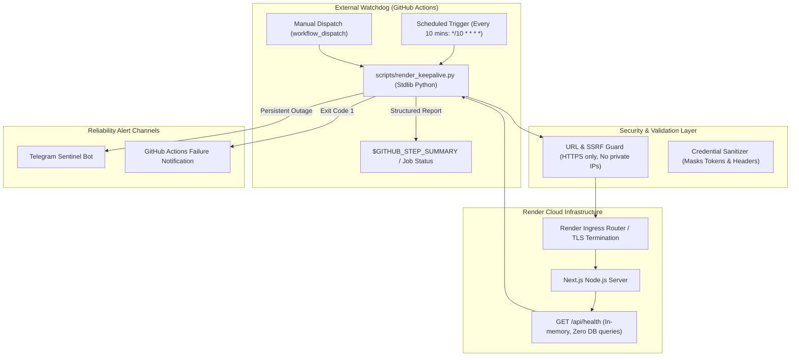
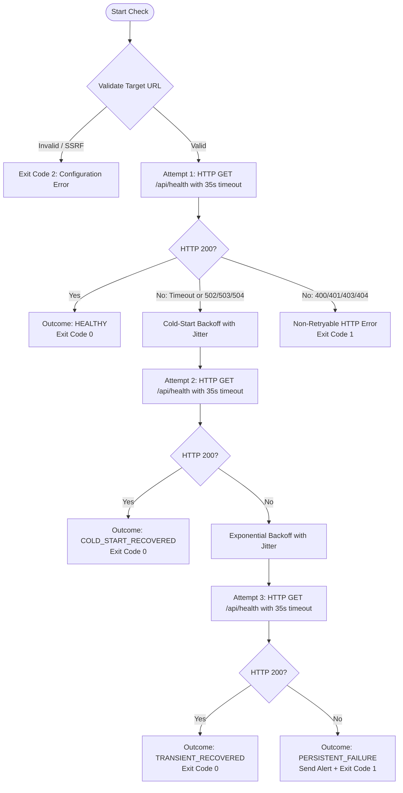

# Autonomous Render Keep-Alive / Reliability Watchdog Agent

## 1. Purpose & Overview

The **Research Opportunity Radar** application is hosted on Render's cloud infrastructure. On Render's standard free/starter hosting tiers, services are configured to **automatically sleep after 15 minutes of inactivity** (zero inbound HTTP traffic). When a service sleeps:
1. Incoming user requests experience cold-start latency (often 20–45 seconds) while the container image spins up.
2. Background schedulers not bound to dedicated persistent worker processes may experience dormancy.
3. Health monitoring can falsely report outages if initial requests timeout before the container initializes.

The **Render Keep-Alive Watchdog Agent** is an external reliability mechanism designed to eliminate idle dormancy. Running entirely outside Render inside **GitHub Actions**, the agent:
- Periodically queries the application's lightweight health endpoint (`/api/health`) every **10 minutes** (comfortably within the 15-minute window).
- Employs **cold-start-tolerant timeouts** (35 seconds) and **bounded exponential backoff with jitter** so initial wake-up delays are handled smoothly without triggering false alarms.
- Is **completely decoupled** from the Render container and requires **zero external pip packages** (100% Python standard library).
- Emits structured JSON observability metrics and dispatches alerts only when genuine persistent outages occur.

---

## 2. Architecture



### Execution & Failure Flow



---

## 3. Step-by-Step Setup Guide

### Step 1: Obtain your Render URL
Log in to your [Render Dashboard](https://dashboard.render.com), open the **Research Opportunity Radar** web service, and copy the public HTTPS service URL (e.g. `https://research-opportunity-radar.onrender.com`).

### Step 2: Configure GitHub Repository Variable
1. Navigate to your GitHub repository.
2. Go to **Settings** → **Secrets and variables** → **Actions**.
3. Under the **Variables** tab (or **Secrets** tab), click **New repository variable**.
4. Name: `RENDER_APP_URL`
5. Value: `https://your-service-name.onrender.com` (Ensure it starts with `https://` and has no trailing slash).
6. Click **Add variable**.

### Step 3: (Optional) Configure Telegram Outage Alerts
If you want instant push notifications when the application is down after 3 retries:
1. In the same GitHub Actions Settings page, switch to the **Secrets** tab.
2. Add `KEEPALIVE_ALERT_TELEGRAM_TOKEN` (or use existing `TELEGRAM_BOT_TOKEN`).
3. Add `KEEPALIVE_ALERT_TELEGRAM_CHAT_ID` (or use existing `TELEGRAM_CHAT_ID`).

### Step 4: Verify with Manual Dispatch
1. In GitHub, go to the **Actions** tab.
2. Select the **Render Keep Alive** workflow from the left sidebar.
3. Click **Run workflow** → select branch `main` → click **Run workflow**.
4. Inspect the workflow execution logs and verify the **Render Keep-Alive Watchdog Report** summary.

---

## 4. Operational Semantics & Cadence

| Parameter | Value | Rationale |
| :--- | :--- | :--- |
| **Cadence** | Every 10 minutes (`*/10 * * * *`) | Provides a 5-minute safety margin before Render's 15-minute sleep timer expires, without creating excessive log clutter or billing overhead. |
| **Endpoint** | `GET /api/health` | Lightweight, in-memory route returning `{"status":"ok","service":"research-opportunity-radar"}`. Zero database operations and zero ML inference. |
| **Timeout** | 35.0 seconds | Generous threshold accommodating container cold-starts on sleeping Render nodes. |
| **Max Retries** | 3 bounded attempts | Bounded retries prevent runaway workflow execution while ensuring transient hiccups are resolved. |
| **Backoff & Jitter** | `3.0s * 2^(attempt-1) + jitter` | Avoids thundering-herd issues on reviving containers. |

---

## 5. Cold-Start Handling & Error Classification

The agent classifies each execution into one of five distinct outcome states:

1. **`HEALTHY`** (Exit Code 0):
   - The service was warm and returned HTTP 200 on Attempt 1.
2. **`COLD_START_RECOVERED`** (Exit Code 0):
   - Attempt 1 timed out or returned 502/503/504 while Render spun up the container from sleep. Attempt 2 succeeded with HTTP 200.
3. **`TRANSIENT_RECOVERED`** (Exit Code 0):
   - Succeeded after experiencing and recovering from a transient error.
4. **`PERSISTENT_FAILURE`** (Exit Code 1):
   - All 3 retries failed, or a fatal status was encountered. Dispatches alert and fails workflow.
5. **`CONFIGURATION_ERROR`** (Exit Code 2):
   - Missing target URL, invalid scheme (plain HTTP rejected), or SSRF violation.

### Error Retryability Matrix

| HTTP Status / Condition | Category | Watchdog Action |
| :--- | :--- | :--- |
| **`200 OK`** | Success | Mark healthy/recovered; terminate loop with exit 0. |
| **`Timeout / 502 / 503 / 504`** | Cold start / Gateway | Retry with exponential backoff & jitter (up to 3 attempts). |
| **`400 / 401 / 403 / 404`** | Fatal / Misconfigured | Abort immediately without retrying; exit 1. |
| **`Private IP / Loopback`** | Security / SSRF | Abort immediately with configuration error; exit 2. |

---

## 6. Security & SSRF Protection

1. **HTTPS Enforcement**:
   - The agent strictly enforces HTTPS for remote targets. Plain `http://` is rejected unless the explicit `--allow-insecure-http` flag is passed (reserved for local testing).
2. **Anti-SSRF IP Validation**:
   - Hostnames and IP literals are validated against private, reserved, loopback, and cloud metadata ranges (`127.0.0.0/8`, `10.0.0.0/8`, `172.16.0.0/12`, `192.168.0.0/16`, `169.254.169.254`, `::1`). Requests targeting internal AWS/GCP/Azure metadata services are rejected before any socket is opened.
3. **Log Sanitization**:
   - The agent sanitizes all stdout/stderr streams with regular expressions that mask Telegram bot tokens (`bot\d+:[A-Za-z0-9_-]+`), bearer tokens, and API secrets.

---

## 7. Observability & Structured Output

At the conclusion of every execution, the agent prints a standardized JSON summary block to stdout:

```json
{
  "target": "render",
  "url": "https://research-opportunity-radar.onrender.com/api/health",
  "endpoint": "/api/health",
  "attempts": 1,
  "http_status": 200,
  "latency_ms": 384.2,
  "result": "healthy",
  "failure_class": null,
  "timestamp": "2026-09-17T15:54:22Z"
}
```

The GitHub Actions workflow extracts this block and attaches it directly to the GitHub Step Summary for convenient visibility in the repository Actions tab.

---

## 8. CLI Usage & Local Testing

The watchdog script can be run locally using the Python standard library:

```bash
# Validate configuration and URL without sending network traffic
python scripts/render_keepalive.py --url https://research-opportunity-radar.onrender.com --dry-run

# Run against local Next.js dev server (with local insecure HTTP permitted)
python scripts/render_keepalive.py --url http://localhost:3000 --path /api/health --allow-insecure-http --verbose

# Run a live test against the deployed Render URL
python scripts/render_keepalive.py --url https://research-opportunity-radar.onrender.com --verbose

# Test Telegram alert credentials without running an HTTP check
python scripts/render_keepalive.py --alert-test
```

---

## 9. Limitations & Redundancy Recommendations

> [!WARNING]
> **Important Reliability Notice**:
> The Keep-Alive Watchdog Agent significantly reduces Render idle sleeping by providing steady inbound traffic every 10 minutes. However, **no scheduled cron mechanism can mathematically guarantee 100.00% uptime**:
> 1. **GitHub Actions Scheduler Jitter**: GitHub Actions schedule triggers run on shared queues and can occasionally experience scheduling delays of 2–15 minutes during peak GitHub load.
> 2. **Provider Maintenance**: Render infrastructure upgrades or routing restarts can temporarily disconnect incoming requests.

### Redundancy Recommendation:
For mission-critical production monitoring, configure a complimentary free external uptime ping (such as [UptimeRobot](https://uptimerobot.com) or [BetterStack](https://betterstack.com)) pointed at `https://your-app.onrender.com/api/health` on a 5-minute interval as a secondary monitor. This provides multi-cloud redundancy independent of GitHub's scheduling infrastructure.
